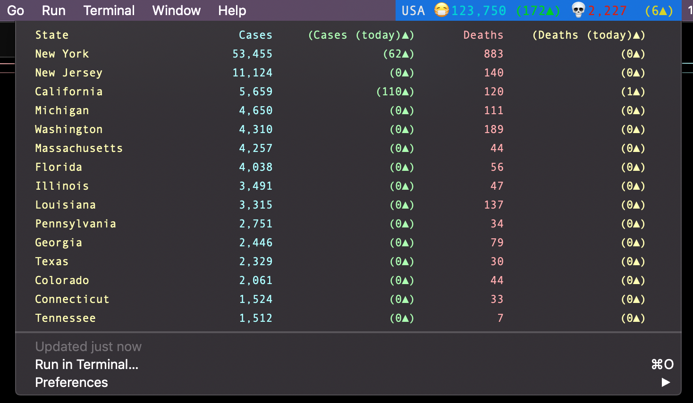
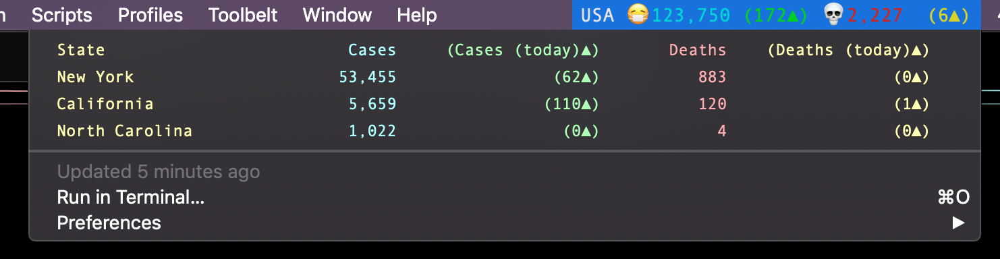

# covid-bitbar
This shell script allows you to see frequently-updated stats for the COVID-19 pandemic in the United States.

# Requirements
- Bitbar `https://github.com/matryer/bitbar`
- node
- npm
- corona-cli `https://github.com/ahmadawais/corona-cli`

# Configuration
The following variables are intended to be set by the user. BITBAR_DIR is the directory you would like to keep the small cache files this script will create. STATES is an array of strings for each state you want detailed COVID-19 stats of. TOP_N allows you to change between listing the top 'n' states or the specific states in STATES. N_STATES determines how many states are listed by TOP_N.
```
BITBAR_DIR=~/Code/bitbar_plugins                                              
STATES=("North Carolina" "New York" "California")                             
TOP_N=false                                                                   
N_STATES=10  
```    
# In action

Closed with stats for USA:


Open, with the top 15 states by number of cases:


Open, with only custom states:
